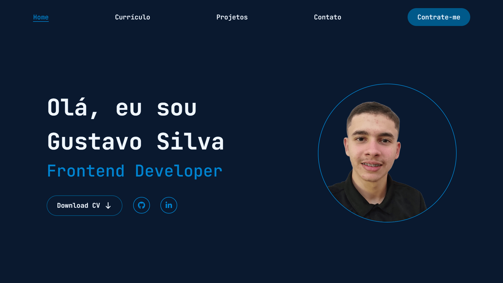
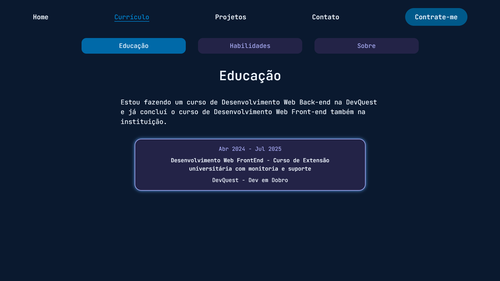
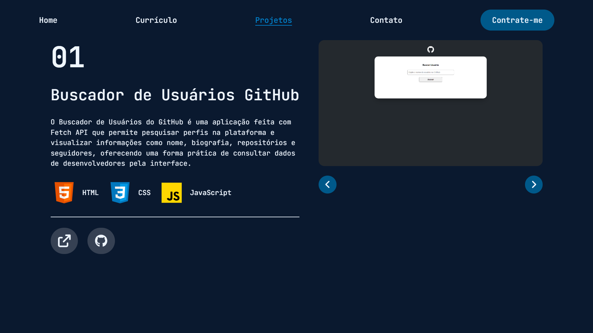
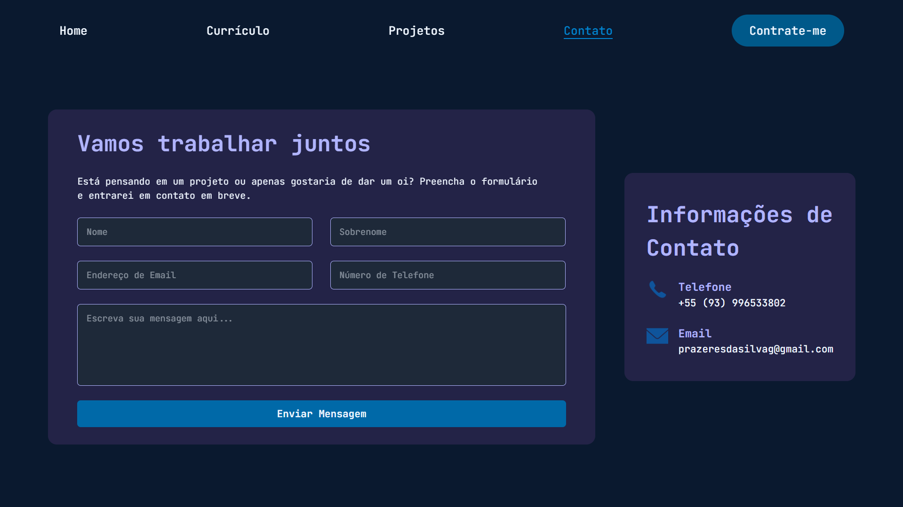
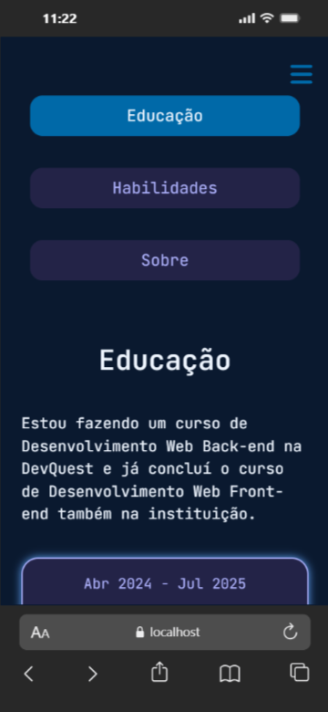
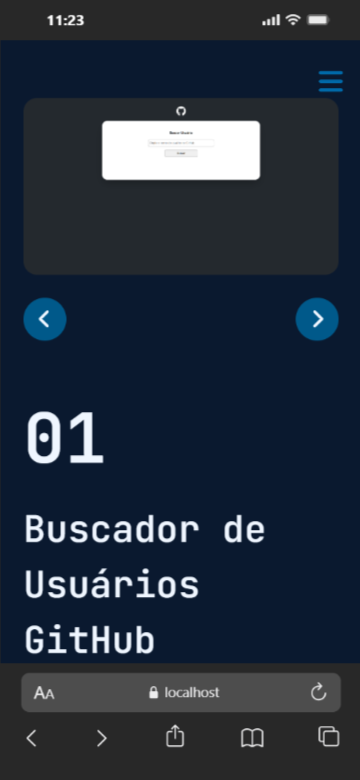
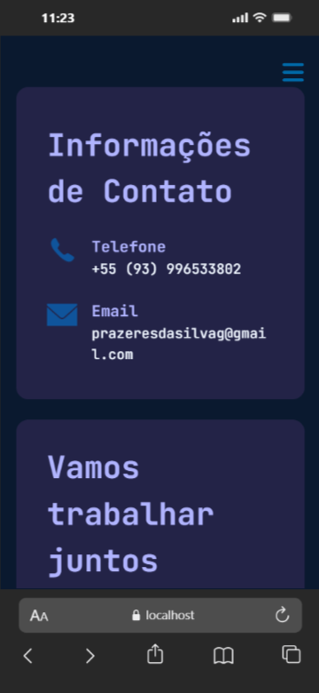

# Portfólio – Gustavo Silva

Este é o meu portfólio pessoal desenvolvido com o objetivo de apresentar meus projetos, habilidades e experiências como desenvolvedor front-end.
O projeto foi criado para demonstrar minha proficiência em tecnologias modernas de front-end, com foco em performance, animações suaves e design responsivo.

## 🧠 Sobre o Projeto

O portfólio conta com quatro seções principais:

- **🏠 Home:** Apresentação pessoal com destaque para nome, cargo e chamada de ação.

- **📜 Currículo:** Exibe minhas experiências, habilidades e certificações.

- **💻 Projetos:** Mostra meus principais projetos, com links, descrições e tecnologias utilizadas.

- **✉️ Contato:** Formulário interativo para envio de mensagens diretamente pelo site.

O objetivo é oferecer uma navegação fluida e moderna, valorizando a estética, a performance e a experiência do usuário.

## 🧪 Tecnologias Utilizadas

- **⚛️ React JS** – Biblioteca JavaScript para criação de interfaces reativas e componentizadas.
- **🟦 TypeScript** – Superset do JavaScript que adiciona tipagem estática e mais segurança ao código.
- **🌬️ Tailwind CSS** – Framework de utilitários CSS que permite estilização rápida e responsiva.
- **⚡ Vite** – Ferramenta de build ultrarrápida para desenvolvimento moderno.
- **🎞️ Framer Motion** – Biblioteca de animações para React, usada para transições suaves e interações dinâmicas.

## 🚀 Funcionalidades

- **✨ Transições Animadas:** Movimentos suaves entre seções utilizando o Framer Motion.
- **📱 Layout Responsivo:** Totalmente adaptável para dispositivos móveis, tablets e desktops.
- **⚡ Performance Otimizada:** Construído com Vite e técnicas de otimização visual e de código.
- **🧩 Componentes Reutilizáveis:** Estrutura organizada e de fácil manutenção.
- **🎨 Design Minimalista:** Interface moderna com cores suaves e foco na legibilidade.

## ⚙️ Como Rodar o Projeto

### 1. Clone este repositório

```bash
git clone https://github.com/gustavo-gsilva/novo-portfolio.git
```

### 2. Acesse a pasta do projeto:

```bash
cd novo-portfolio
```

### 3. Instale as dependências:

```bash
npm install
```

### 4. Inicie o servidor de desenvolvimento:

```bash
npm run dev
```

---

🔗 Veja também o arquivo [`CHANGELOG.md`](./CHANGELOG.md) para detalhes das atualizações.

## 📸 Demonstração 

- **Imagens versão desktop**  
  

  

  

  

  - **Imagens versão mobile**  
  

  

  

  